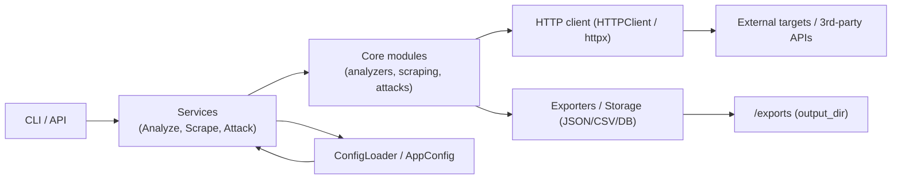

# Development Guide

This guide covers development, testing, and contribution guidelines for CiberWebScan.

## Development Setup

### Prerequisites

- Python 3.10 or higher
- Git
- Virtual environment (recommended)

### Clone and Setup

```bash
git clone https://github.com/HC-ONLINE/CiberWebScan.git
cd CiberWebScan
python -m venv venv
source venv/bin/activate  # On Windows: venv\Scripts\activate
pip install -e ".[dev]"
```

### Install Playwright Browsers

```bash
playwright install
```

## Project Structure

```textplain
src/ciberwebscan/
├── api/              # REST API implementation
├── cli/              # Command-line interface
├── config/           # Configuration management
├── core/             # Core functionality
│   ├── analyzers/    # Security analyzers
│   ├── attacks/      # Attack simulation
│   ├── client/       # HTTP client
│   └── scraping/     # Web scraping
├── export/           # Export functionality
├── services/         # Business logic services
└── utils/            # Utilities

tests/                # Test suite
docs/                 # Documentation
scripts/              # Development scripts
```

### Data flow (overview)

A high-level view of how data moves through CiberWebScan (CLI/API → services → core → HTTP → external resources → exporters).



This diagram helps contributors understand where to mock or patch during tests (patch at the boundary used by the module under test — e.g. the `HTTPClient` import used inside `services.*`).

## Development Workflow

### Code Style

The project uses:

- **Ruff** for code formatting
- **Pyright** for type checking

### Pre-commit Hooks

Install pre-commit hooks:

```bash
pre-commit install
```

Run manually:

```bash
pre-commit run --all-files
```

### Running Tests

#### All Tests

```bash
pytest
```

#### With Coverage

```bash
pytest --cov=ciberwebscan --cov-report=html
```

#### Specific Test File

```bash
pytest tests/unit/core/analyzers/test_ssl.py
```

#### Integration Tests

```bash
pytest tests/integration/
```

- Place in `tests/integration/`
- Test component interactions
- May require external services (use test containers)
- Slower than unit tests

### Type Checking

```bash
pyright
```

### Linting

```bash
ruff check .
```

### Formatting

```bash
ruff format .
```

## Testing Guidelines

### Unit Tests

- Place in `tests/unit/`
- Test individual functions/classes
- Mock external dependencies
- Use descriptive test names

### Test Structure

```python
import pytest
from ciberwebscan.core.analyzers.ssl import SSLAnalyzer

class TestSSLAnalyzer:
    def test_analyze_valid_cert(self):
        analyzer = SSLAnalyzer()
        result = analyzer.analyze("https://example.com")
        assert result.valid

    def test_analyze_expired_cert(self):
        # Test implementation
        pass
```

### Fixtures

Common fixtures are in `tests/conftest.py`:

- `test_client`: HTTP client for testing
- `sample_html`: Sample HTML content
- `mock_response`: Mock HTTP responses

### Mocking example

Quick, copy‑paste examples showing recommended patterns used across the test-suite.

1. Patch `HTTPClient` used as a context manager (unittest.mock / patch):

```python
from unittest.mock import Mock, patch
from ciberwebscan.services.analyze_service import AnalyzeService, AnalyzeOptions

@patch("ciberwebscan.core.client.http_client.HTTPClient")
def test_analyze_with_mock_http_client(mock_http_client):
    # Prepare the HTTP client instance returned by the context manager
    mock_client = Mock()
    mock_response = Mock(headers={}, text="<html><title>OK</title></html>")
    mock_client.get.return_value = mock_response

    # HTTPClient(...) is used as a context manager in services — set __enter__.return_value
    mock_http_client.return_value.__enter__.return_value = mock_client

    svc = AnalyzeService()
    res = svc.analyze(AnalyzeOptions(url="https://example.com"))

    assert res.success
    mock_client.get.assert_called_once()
```

2. Same idea using `pytest-mock` (`mocker`):

```python
def test_analyze_with_mocker(mocker):
    mock_client = mocker.Mock()
    mock_resp = mocker.Mock(headers={}, text="<html></html>")
    mock_client.get.return_value = mock_resp

    patched = mocker.patch("ciberwebscan.core.client.http_client.HTTPClient")
    patched.return_value.__enter__.return_value = mock_client

    svc = AnalyzeService()
    res = svc.analyze(AnalyzeOptions(url="https://example.com"))

    assert res.success
    mock_client.get.assert_called_once()
```

Notes / best practices

- Patch the exact import path used by the module under test (e.g. `ciberwebscan.services.analyze_service` imports `HTTPClient` from `ciberwebscan.core.client.http_client`).
- If the object under test uses a context manager, set `return_value.__enter__.return_value` on the patched class.
- Prefer `spec`/`spec_set` or `Mock(spec=...)` when creating mock clients to catch incorrect attribute usage early.
- The repository already provides a `mock_http_client` fixture (see `tests/unit/core/attacks/conftest.py`) — reuse it when appropriate.

## Future API Development

### Adding New Endpoints

1. Define request/response models in `api/models/`
2. Implement endpoint in appropriate route file
3. Add validation and error handling
4. Update API documentation

### Request/Response Models

```python
from pydantic import BaseModel

class MyRequest(BaseModel):
    url: str
    option: bool = True

class MyResponse(BaseModel):
    result: str
    timestamp: datetime
```

### Route Implementation

```python
from fastapi import APIRouter
from ciberwebscan.api.models import MyRequest, MyResponse

router = APIRouter()

@router.post("/my-endpoint", response_model=MyResponse)
async def my_endpoint(request: MyRequest) -> MyResponse:
    # Implementation
    return MyResponse(result="success")
```

## CLI Development

### Adding New Commands

1. Create command file in `cli/commands/`
2. Use Typer for command definition
3. Add validation and error handling
4. Update CLI documentation

### Command Structure

```python
import typer
from ciberwebscan.cli.validators import validate_url

my_command = typer.Typer()

@my_command.command("subcommand")
def my_subcommand(
    url: str = typer.Argument(..., help="URL to process"),
    option: bool = typer.Option(False, help="Enable option")
):
    validated_url = validate_url(url)
    # Implementation
```

## Core Development

### Adding New Analyzers

1. Create analyzer class in `core/analyzers/`
2. Inherit from base analyzer
3. Implement analysis logic
4. Add to analyzer registry

### Analyzer Structure

```python
from ciberwebscan.core.analyzers.base import Analyzer

class MyAnalyzer(Analyzer):
    def analyze(self, target: str) -> AnalysisResult:
        # Analysis logic
        return AnalysisResult(...)
```

### Adding New Attacks

1. Create attack class in `core/attacks/`
2. Inherit from `AttackEngine`
3. Implement attack logic
4. Add payload loading if needed

### Attack Structure

```python
from ciberwebscan.core.attacks.base import AttackEngine

class MyAttack(AttackEngine):
    def __init__(self):
        super().__init__("my_attack")

    def execute(self, target: str, **kwargs) -> AttackResult:
        # Attack logic
        return AttackResult(...)
```

## Configuration

### Adding New Settings

1. Update `config/models.py` if needed
2. Document in configuration guide

## Export Development

### Adding New Formats

1. Create exporter in `export/`
2. Implement export interface
3. Add to export registry

## Error Handling

### Custom Exceptions

```python
class CiberWebScanError(Exception):
    """Base exception for CiberWebScan."""
    pass

class AnalysisError(CiberWebScanError):
    """Analysis-related errors."""
    pass
```

### Error Responses

Use consistent error response format:

```python
from ciberwebscan.api.models.responses import ErrorResponse

raise HTTPException(
    status_code=400,
    detail=ErrorResponse(
        error="Invalid input",
        error_code="VALIDATION_ERROR"
    ).dict()
)
```

## Logging

Use the standard logging module:

```python
import logging

logger = logging.getLogger(__name__)

logger.info("Processing started")
logger.error("An error occurred", exc_info=True)
```

## Performance Considerations

- Use async/await for I/O operations
- Profile code with `cProfile`
- Use efficient data structures

## Security

- Validate all inputs
- Use secure defaults
- Avoid storing sensitive data
- Follow OWASP guidelines

## Contributing

### Pull Request Process

1. Fork the repository
2. Create a feature branch
3. Make changes with tests
4. Run full test suite
5. Update documentation
6. Submit pull request

### Commit Messages

Use conventional commit format:

```text
feat(analyzer): add new SSL expiry check
fix(cli): resolve crash when URL is missing protocol
docs(config): clarify proxy rotation settings
```

### Code Review

- All changes require review
- No new linting errors
- Documentation updated

## Release Process

1. Update version
2. Update changelog
3. Run full test suite
4. Create release tag

## Troubleshooting

### Common Issues

1. **Import errors**: Ensure virtual environment is activated
2. **Test failures**: Check test dependencies
3. **Type errors**: Run `pyright` for details
4. **Linting errors**: Run `ruff check --fix`

### Getting Help

- Check existing issues
- Review documentation
- Ask in discussions
